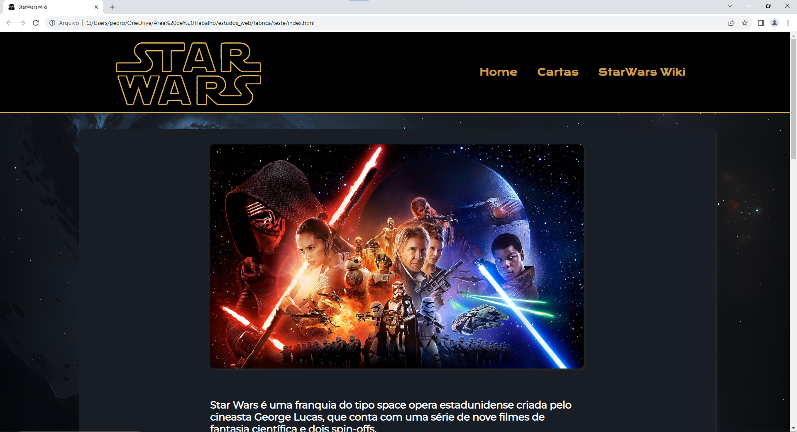
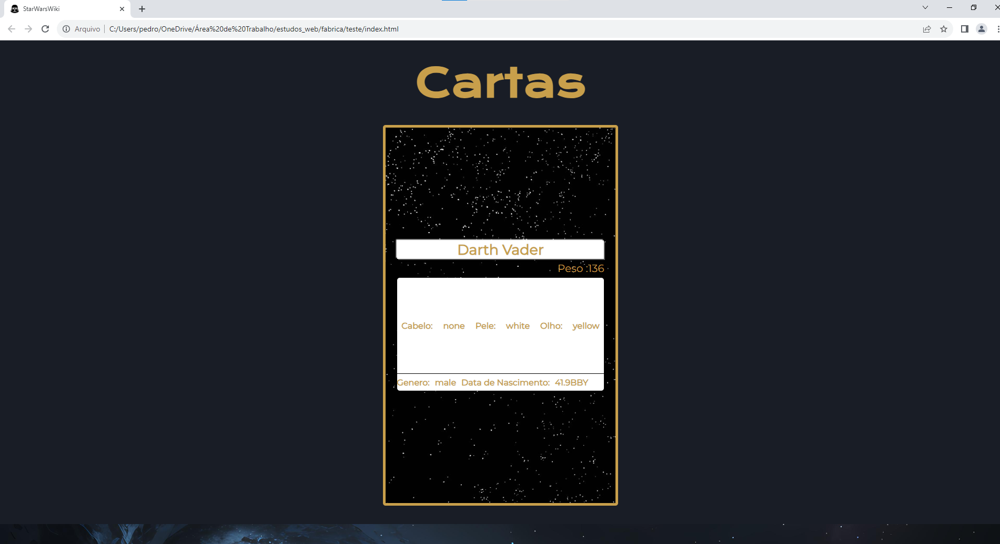
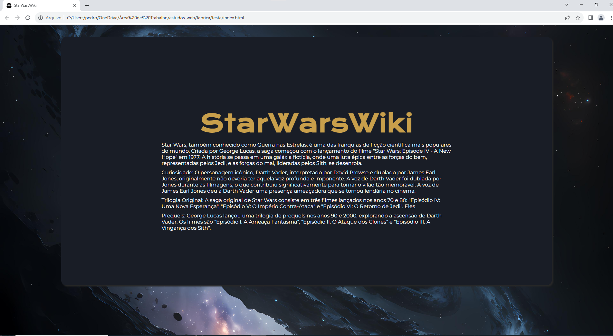

# workshop-frontend-2023.2

<h1> Desafio StarWars </h1>

Esse é o projeto que eu fiz para o desafio do worksjop da fabrica

<h1>
  
        
        
</h1>

## Sobre o projeto💻

Foi um desafio da fabrica que tinha como requisitos: Um header que contenha no mínimo a opção de INÍCIO e GALERIA 
e era necessário consumir a API e exibir os elementos de Star Wars na tela com um card.

## Tecnologias🔨:

- JavaScript
- HTML
- CSS
